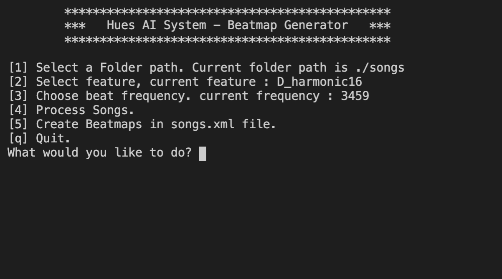

# 0x40 Audio Feature Extract to Beat Labels

I figure I'd share what little I have done in case anyone else wants to try diving into it.

But figured this might be useful for someone else in the future. I also plan to keep looking at it.

I've written some code to wrangle the data from the respacks. 

Basically processing the xml files into hashmaps so as to attempt to correlate the audio against the defined beats. Put into a convenient jupyter-lab notebook format for future use. 

I've been trying to utilize random forests against the features/labels. 
Basically attempting to correlate an audio feature to a beat, and then fit a model against that with not much luck. I think there's only a few things wrong with it before it'll fit to a tree. But since the data has been mostly wrangled, attempting to fit it to a CNN or some other data model should be easier. 

## Terminal app

Pretty self explanatory. Folder needs to have current path i.e. ./songs

Only 2 kinds of features and mix

Currently 4 different beat frequencies

Create beat maps in songs.xml file not working, just outputting to song_output file

## Features to add
Add different audio features and train neural nets more specifically on genres/features/more data.

## Libraries
You'll need to figure out how to install librosa, numpy, sklearn, matplot, xml.dom.minidom. Depending on your OS it can be a pain in the ass to install. 

